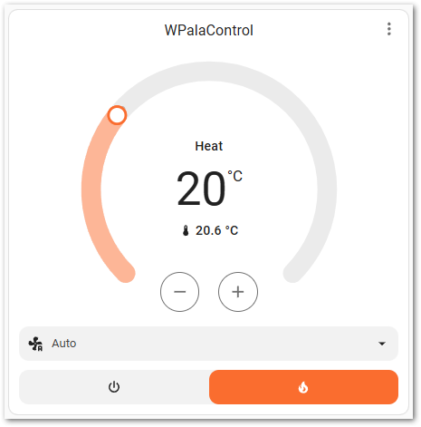
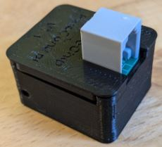
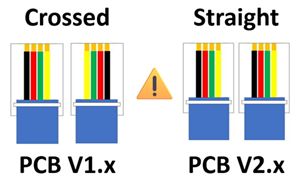
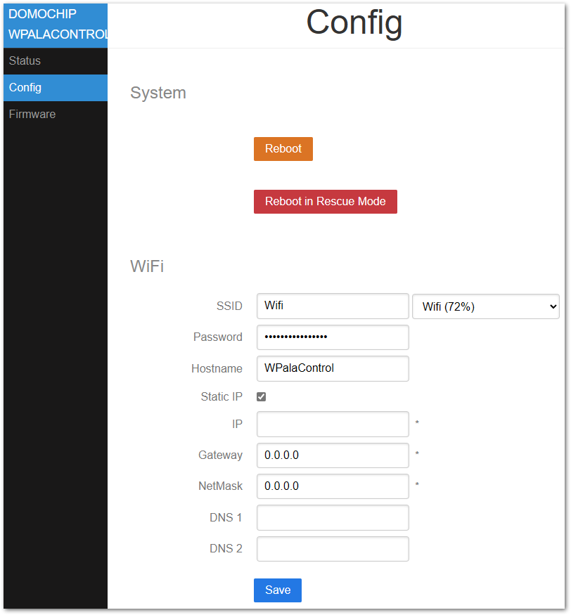
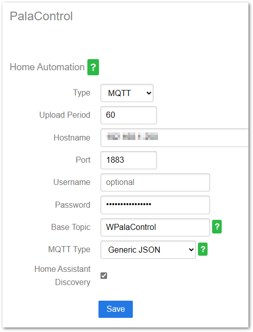

# WPalaControl

**WPalaControl** is a device designed to control and monitor Fumis-based stoves using a D1 Mini.  
It allows you to power on/off, adjust the set point, change fan speeds, and retrieve status, alarms, and temperature data from your stove.  

It supports native HTTP requests which makes it fully compatible with all existing Palazzetti/Fumis home automation plugins/apps.  

It also integrates with MQTT to monitor/control your stove in a much more efficient way.  

## Stove Compatibility

WPalaControl is compatible with stoves using the Fumis Controller, which is used by many manufacturers, including:  
  
Palazzetti / Jotul / TurboFonte / Godin / Fonte Flamme / Invicta / Casatelli / Alpis / Faizen / HETA / ...

To determine if your stove is compatible with WPalaControl, look for the following Control Panel or Motherboard:  


## Home Automation compatibility

|  | [MQTT Integration](https://www.home-assistant.io/integrations/mqtt/) (autodiscovery) <br> Most options and fans control |  |
| ------------- | ------------- | ------------- |
|  | [Palazzetti Integration](https://www.home-assistant.io/integrations/palazzetti)<br> (2024.11 minimum) <br> Basic implementation for now |  |
|  | [Palazzetti plugin](https://www.jeedom.com/market/index.php?v=d&p=market_display&id=3104) |  |

## Make/Get your adapter



🔧 If you want to build it yourself, you can find all details here : [BUILD](BUILD.md) 🔧  

🛍️🚀 Otherwise, I'm producing some small batches and offering it ready-to-use here :  
[](https://www.tindie.com/products/35770/)  

## Connect

⚠️ **Before connecting, please check that you are using the correct cable**  
For Hardware V1.x: please use a **Crossed** cable  
For Hardware V2.x: please use a **Straight** cable  
_(Hardware version is written on the box and on the PCB)_



✅If your stove has an accessible RJ12 connector, simply connect the cable.  

🔍If not, you'll need an additional cable and a splitter.  
➡️ More details can be found in the [Splitter Cabling documentation](SPLITTERCABLING.md)

## First Boot

During the first Boot, the WPalaControl creates its own Wi-Fi network (AP mode)  

Firmware version **3.2.0 and higher**:  

- Network SSID : `WPalaControl`
- Password : `password`

Version **3.1.x and lower**:  

- Network SSID : `WirelessPalaControlXXXX`
- Password : `PasswordPalaControl`

You should be automatically redirected to the module page.  
If not, go to 👉 <http://wpalacontrol.local> 👈

## Configuration pages

### Status

Provides useful informations about the module and the stove.  
**The stove SN appears then followed, 1 minute later, by refreshed stove information**  


### Config



#### System

- **Reboot**: restart the module
- **Reboot in Rescue Mode**: restart the module with default configuration

#### WiFi

- **ssid & password**: IDs of your Wifi Network  
- **hostname**: name of ESP on the network  
- **IP, GW, NetMask, DNS1&2**: Fixed IP configuration  



#### PalaControl - Home Automation

- **Type**: enable/disable MQTT communication  
- **Upload Period**: set the refresh interval of stove information (in seconds)  
- **Hostname, Port, Username, Password**: MQTT server details (username and password are - optional)  
- **Base Topic**: prefix for WPalaControl topic structure  
- **MQTT Type**: defines MQTT topics and data structure:  
  - **Generic**: publish raw values under the base topic (e.g. "{baseTopic}/T1" = "*20.00*")
  - **Generic JSON**: publish values JSON to "category" topic under base topic (e.g. "{baseTopic}/TMPS" = "*{"INFO":{"CMD":"GET TMPS","RSP":"OK......*")
  - **Generic Categorized**: publish raw values to "category" topic under base topic (e.g. "{baseTopic}/TMPS/T1" = "*20.00*")
- **Home Assistant Discovery**: Enable/disable Home Assistant auto-discovery

### Firmware

Aallows you to flash a new firmware version directly from GitHub releases or using `WPalaControl.*.bin` or `WirelessPalaControl.*.bin` file:  
  
Ensure the module has Internet access and/or DNS configured if IP address is static

## Use it

### HTTP

Natively, HTTP GET request can be sent directly to the module.  

```
http://wpalacontrol.local/cgi-bin/sendmsg.lua?cmd={command}
```

### MQTT

Send commands via MQTT to `%BaseTopic%/cmd` topic once MQTT is configured.  
Execution result is:

- published following the configured MQTT Type
- published on `%BaseTopic%/result` in JSON format

Module connection status is published to `%BaseTopic%/connected`:

- 0: not connected
- 1: connected but no communication with the stove
- 2: module and stove connected

### Command List
  
- `GET+STDT`: get static data
- `GET+ALLS`: get all status data
- `GET+STAT`: get status of the stove⏲️
- `GET+TMPS`: get temperatures of the stove⏲️
- `GET+FAND`: get Fan values⏲️
- `GET+SETP`: get current Set Point (desired temperature)⏲️
- `GET+POWR`: get current power (1-5)⏲️
- `GET+CUNT`: get some counters
- `GET+CNTR`: get some counters (same as GET+CUNT)⏲️
- `GET+DPRS`: get delta pressure data⏲️
- `GET+TIME`: get stove clock data⏲️
- `GET+IOPT`: get IO ports status
- `GET+SERN`: get stove Serial Number
- `GET+MDVE`: get stove model and fw version
- `GET+CHRD`: get chrono data
- `GET+PARM+92`: get parameter (ex : 92=pellet type (1-3))
- `GET+HPAR+57`: get hidden parameter (ex : 57=% of pellet to feed for pellet type 3)
- `BKP+PARM+CSV`: get all parameters in a CSV file (HTTP only) ✨
- `BKP+PARM+JSON`: get all parameters in a JSON file (HTTP only) ✨
- `BKP+HPAR+CSV`: get all hidden parameters in a CSV file (HTTP only) ✨
- `BKP+HPAR+JSON`: get all hidden parameters in a JSON file (HTTP only) ✨
- `CMD+ON`: turn stove ON
- `CMD+OFF`: turn stove OFF
- `SET+POWR+3`: set power (1-5)
- `SET+PWRU`: increase power by 1 unit
- `SET+PWRD`: decrease power by 1 unit
- `SET+SETP+20`: set Set Point (desired temperature)
- `SET+STPF+19.8`: set Set Point with a 0.2° precision (depend of your stove model)✨
- `SET+STPU`: increase Set Point by 1 unit
- `SET+STPD`: decrease Set Point by 1 unit
- `SET+RFAN+7`: set Room Fan value (0-5;6=Max;7=Auto)
- `SET+FN2U`: increase Room Fan by 1 unit
- `SET+FN2D`: decrease Room Fan by 1 unit
- `SET+FN3L+0`: set Room Fan 3 value (0-5)
- `SET+FN4L+0`: set Room Fan 4 value (0-5)
- `SET+SLNT+0`: set Silent mode value (0-1)
- `SET+TIME+2023-12-28+19:42:00`: set stove Date and Time (2000-2099) (1-12) (1-31) (0-23) (0-59) (0-59)
- `SET+CSST+0`: set Chrono Status value (0-1)
- `SET+CSTH+2+18`: set Chrono Program Start Hour (1-6) (0-23)
- `SET+CSTM+2+30`: set Chrono Program Start Minute (1-6) (0-59)
- `SET+CSPH+2+22`: set Chrono Program Stop Hour (1-6) (0-23)
- `SET+CSPM+2+45`: set Chrono Program Stop Minute (1-6) (0-59)
- `SET+CSET+2+19`: set Chrono Program Set Point (1-6) (desired temperature)
- `SET+CDAY+7+3+6`: set Chrono Program for week day (Day-Mem-Prog) (1-7) (1-3) (1-6)
- `SET+CPRD+1+19+18+30+22+45`: set Chrono Program data (Prog-Temp-StartH-StartM-StopH-StopM) (1-6) (temperature) (0-23) (0-59) (0-23) (0-59)
- `SET+PARM+92+2`: set parameter 92 to value 2 (ex : 92=pellet type (1-3))
- `SET+HPAR+57+95`: set hidden parameter 57 to value 95 (ex : 57=% of pellet to feed for pellet type 3)

⏲️: Published automatically  
✨: WPalaControl specific commands

### Description

MQTT infos published every "Upload Period":

- `STATUS`: status of the stove
- `LSTATUS`: status of the stove
- `T1`, `T2`, `T3`, `T4`, `T5`: temperature of the stove
- `F1V`, `F2V`, `F2L`, `F2LF`, `F3L`, `F4L`: fan values (meaning depend of your stove model)
- `IGN`: ignition counter
- `IGNERRORS`: ignition error counter
- `POWERTIME`: total heating time (hour:minute)
- `HEATTIME`: ??? (hour:minute)
- `SERVICETIME`: heating time since last maintenance (hour:minute)
- `ONTIME`: time from last power ON (hour:minute)
- `OVERTMPERRORS`: overtemperature error counter
- `STOVE_DATETIME`: date of the stove
- `STOVE_WDAY`: week day of the stove
- `SETP`: current Set Point (desired temperature)
- `PQT`: wood pellet consumption
- `PWR`: current power (1-5)
- `FDR`: feeder
- `DP_TARGET`: delta pressure target
- `DP_PRESS`: actual delta pressure
